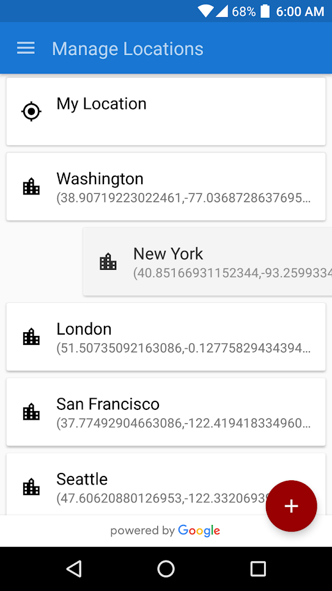

# AverageWeather
Average Weather aggregates data from multiple sources to improve accuracy. This clean and intuitive app provides daily predictions seven days into the future, and hourly forecasts five days ahead. The app uses shared element transitions for clean and completely seemless material animations between activities and fragments. The webservice for aggregating the data is contained in [Backend.](/Backend) The java files and xml are contained in [layout](/app/src/main/res/layout) and [src](/app/src/main/java/xyz/eleventhour/averageweather).
 

