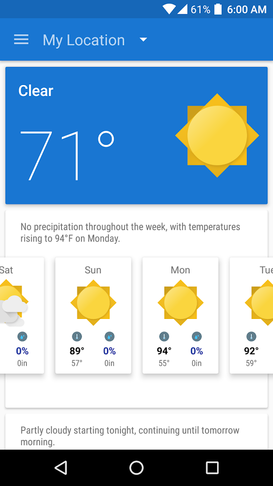

# Average Weather

   

Average Weather is a weather app for Android. It aggregates data from multiple weather sources and provides a clean and simple interface following [Material Design](https://material.io/design) guidelines. The app provides daily predictions seven days into the future, and hourly forecasts five days ahead.

## Overview

The Average Weather [client](app/) is a native Android mobile app written in Java and XML. The app uses data aggregated through a custom PHP [backend](service/). The name "Average Weather" was chosen because the data is gathered from two different Weather APIs to create a complete forecast.

   

## Getting Started

### Dependencies

* [Android Studio](https://developer.android.com/studio)
* An Android device or emulator

### Before Using

* The backend PHP application needs to be publicly hosted.
* The public APIs for weather and Google Maps need to be renewed.
* The app features some hardcoded endpoints that would need to be updated for functionality to be restored.
* Additionally, many dependencies are out of date and may have vulnerabilities.

### Building

To build the app the files in [app/src](app/src) need to be copied into a new Android Studio project. Additional changes would need to be made which are too numerous to list here.

### Using

An pre-built APK is available in [app/release/app-release.apk](app/release/app-release.apk) that can be installed and used with some caveats. 
* Without the webservice available data will never load.
* The APK targets Android API 23 and may have vulnerabilities.

## Design

### Backend

The backend is responsible for querying the external APIs and creating an aggregate forecast. It was designed so that additional sources could be easily added. Data is parsed from each API endpoint and a unified JSON format is created to return to the client. See [service/WeatherSources.php](service/WeatherSources.php) for details on how this is done.

### Client

The Android app is written in Java with [layouts](app/src/res/layout/) described in XML. The app logic is divided various [classes](app/src/java/):

* Activities and Fragments are Android terms for screens or views in the app. The initial screen is [MainActivity.java](app/src/java/MainActivity.java). Some inheritance hirearchies exist between fragments since many views are similar.
* Adapters are classes responsible for taking a list of data and building corresponding views to display the data. For example [LocationSearchResultAdapter.java](app/src/java/LocationSearchResultAdapter.java) builds views for showing auto-complete search results when adding a new location.
* [StorageManager.java](app/src/java/StorageManager.java) caches data to `SharedPreferences` such as user locations and settings.
* [NetworkManager.java](app/src/java/NetworkManager.java) handles all network requests such as loading data, images, and icons from external APIs.
* [DataFormatter.java](app/src/java/DataFormatter.java) is needed when displaying any data that has units. It uses stored user preferences for display units to convert data to desired format.
* Various other assorted classes not listed here.

 The app follows basic Material design patterns with a navigation drawer and top bar. It uses shared element transitions for clean and completely seemless animations between activities and fragments.

     
     

The app loads Google satellite data for the selected location to use as a background image. Additional locations can be searched for and added.

   
   
      

